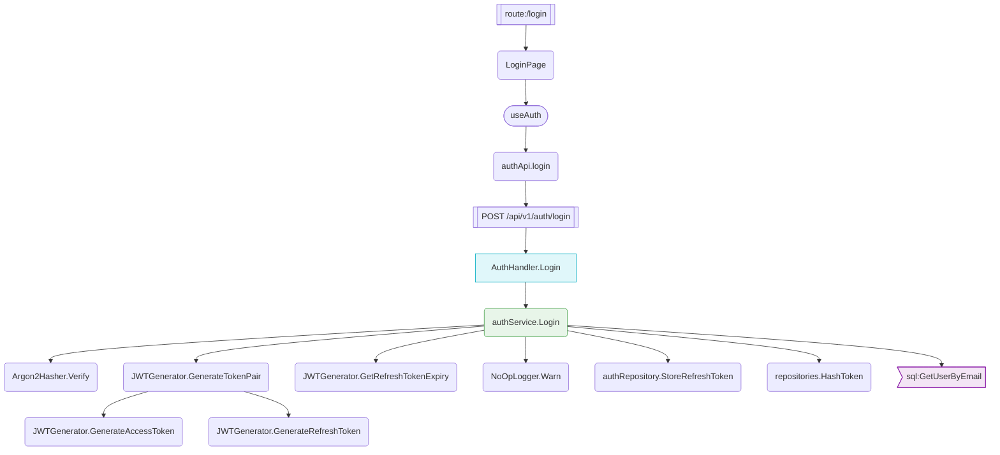

# Real Output Reference

Actual testreg output captured from **nutrition-project-v2** — a full-stack Go + React + React Native monorepo with 184 features, 1103 test files, and 2122 source files across 16 domains.

Use this data verbatim in README examples, GUI wireframes, and Stitch prompts. All output is real — not fabricated.

**Captured:** 2026-04-02
**Project:** nutrition-project-v2 (Go backend, React web, React Native mobile, GraphQL gateway)

---

## testreg scan

```
Scan complete.

  Total test files: 1103
  Mapped:           995
  Unmapped:         108
```

---

## testreg status

```
  Test Coverage Registry
  Generated: now  |  Project: /home/as-main/Documents/projects/nutrition-project-v2

  ┌──────────────────────┬───────┬──────────┬──────────┬──────────┐
  │ Domain               │ Total │ Unit     │ Integ.   │ E2E      │
  ├──────────────────────┼───────┼──────────┼──────────┼──────────┤
  │ admin               │ 12   │ 6/12 ✓  │ 7/12 ✓  │ 3/12 ✓  │
  │ auth                │ 10   │ 9/10 ✓  │ 6/10 ✓  │ 5/10 ✓  │
  │ billing             │ 14   │ 9/14 ✓  │ 8/14 ✓  │ 3/14 ✓  │
  │ client-analytics    │ 10   │ 6/10 ✓  │ 4/10 ✓  │ 4/10 ✓  │
  │ client-management   │ 12   │ 8/12 ✓  │ 3/12 ✓  │ 7/12 ✓  │
  │ communication       │ 11   │ 5/11 ✓  │ 8/11 ✓  │ 2/11 ✓  │
  │ infra               │ 15   │ 10/15 ✓ │ 10/15 ✓ │ 2/15 ✓  │
  │ meals               │ 12   │ 9/12 ✓  │ 6/12 ✓  │ 4/12 ✓  │
  │ patient-dashboard   │ 5    │ 2/5 ✓   │ 3/5 ✓   │ 2/5 ✓   │
  │ plans-nutritionist  │ 14   │ 11/14 ✓ │ 11/14 ✓ │ 9/14 ✓  │
  │ plans-patient       │ 8    │ 2/8 ✓   │ 3/8 ✓   │ 3/8 ✓   │
  │ recipes             │ 10   │ 10/10 OK│ 7/10 ✓  │ 6/10 ✓  │
  │ recovery            │ 14   │ 4/14 ✓  │ 4/14 ✓  │ 3/14 ✓  │
  │ settings            │ 15   │ 9/15 ✓  │ 6/15 ✓  │ 5/15 ✓  │
  │ shopping            │ 10   │ 10/10 OK│ 4/10 ✓  │ 4/10 ✓  │
  │ training            │ 12   │ 12/12 OK│ 4/12 ✓  │ 6/12 ✓  │
  ├──────────────────────┼───────┼──────────┼──────────┼──────────┤
  │ TOTAL               │ 184  │ 66% ~~  │ 51% ~~  │ 37% !!  │
  └──────────────────────┴───────┴──────────┴──────────┴──────────┘

  Critical gaps: 7 critical features missing E2E coverage
```

---

## testreg audit --summary

```
  Priority Summary:
    CRITICAL   31/36 at target  (316 gaps)  █████████░  86%
    HIGH       26/62 at target  (593 gaps)  ████░░░░░░  42%
    MEDIUM     20/65 at target  (447 gaps)  ███░░░░░░░  31%
    LOW        0/21 at target  (231 gaps)  ░░░░░░░░░░   0%

    Overall: 77/184 features at target (42%)
```

---

## testreg trace auth.login

```
  Feature: Login (auth.login)
  Priority: critical
  API Surfaces:
    POST /api/v1/auth/login

  route:/login                                              apps/web/src/router.tsx:142
└─ LoginPage                                                apps/web/src/pages/auth/LoginPage.tsx:13
   └─ useAuth                                               apps/web/src/hooks/useAuth.ts:19
      └─ authApi.login                                      apps/web/src/services/api/auth.ts:46
         └─ POST /api/v1/auth/login                         src/infrastructure/http/handlers/auth_handler.go:576
            └─ AuthHandler.Login                            src/infrastructure/http/handlers/auth_handler.go:249
               └─ authService.Login                         src/application/services/auth_service.go:172
                  ├─ Argon2Hasher.Verify                    src/infrastructure/auth/password.go:68
                  ├─ JWTGenerator.GenerateTokenPair         src/infrastructure/auth/jwt_generator.go:70
                  │  ├─ JWTGenerator.GenerateAccessToken    src/infrastructure/auth/jwt_generator.go:97
                  │  └─ JWTGenerator.GenerateRefreshToken   src/infrastructure/auth/jwt_generator.go:123
                  ├─ JWTGenerator.GetRefreshTokenExpiry     src/infrastructure/auth/jwt_generator.go:132
                  ├─ NoOpLogger.Warn                        src/infrastructure/errors/middleware.go:46
                  ├─ authRepository.StoreRefreshToken       src/domain/repositories/auth_repository.go:329
                  ├─ repositories.HashToken                 src/domain/repositories/auth_repository.go:90
                  └─ sql:GetUserByEmail                     src/domain/repositories/queries/user.sql:21

  Confidence: 100%  |  Nodes: 16  |  Depth: 8
```

---

## testreg audit auth.login

```
  Feature: auth.login (critical)  Health: 100%
  ═══════════════════════════════════════════════════════

  Dependency Chain:
    route:/login  ◐ partial (LoginScreen.test.tsx)                    apps/web/src/router.tsx:142
    └─ LoginPage  ◐ partial (auth.integration.test.ts)                apps/web/src/pages/auth/LoginPage.tsx:13
       └─ useAuth  ◐ partial (useAuth.test.ts)                        apps/web/src/hooks/useAuth.ts:19
          └─ authApi.login  ◐ partial (auth_test.go)                  apps/web/src/services/api/auth.ts:46
             └─ POST /api/v1/auth/login  ◐ partial (auth_e2e_test.go)  src/infrastructure/http/handlers/auth_handler.go:576
                └─ AuthHandler.Login  ◐ partial (auth_e2e_test.go)    src/infrastructure/http/handlers/auth_handler.go:249
                   └─ authService.Login  ✓ tested (auth_service_test.go)  src/application/services/auth_service.go:172
                      ├─ Argon2Hasher.Verify  ◐ partial (jwt_generator_bench_test.go)  src/infrastructure/auth/password.go:68
                      ├─ JWTGenerator.GenerateTokenPair  ◐ partial (middleware_auth_integration_test.go)  src/infrastructure/auth/jwt_generator.go:70
                      │  ├─ JWTGenerator.GenerateAccessToken  ◐ partial (middleware_auth_integration_test.go)  src/infrastructure/auth/jwt_generator.go:97
                      │  └─ JWTGenerator.GenerateRefreshToken  ◐ partial (middleware_auth_integration_test.go)  src/infrastructure/auth/jwt_generator.go:123
                      ├─ JWTGenerator.GetRefreshTokenExpiry  ◐ partial (middleware_auth_integration_test.go)  src/infrastructure/auth/jwt_generator.go:132
                      ├─ NoOpLogger.Warn  ◐ partial (e2e_test.go)     src/infrastructure/errors/middleware.go:46
                      ├─ authRepository.StoreRefreshToken  ✓ tested (auth_repository_test.go)  src/domain/repositories/auth_repository.go:329
                      ├─ repositories.HashToken  ✓ tested (auth_repository_test.go)  src/domain/repositories/auth_repository.go:90
                      └─ sql:GetUserByEmail  ◐ partial (hash_token_bench_test.go)  src/domain/repositories/queries/user.sql:21

  Coverage by Layer:
    Handler:     1/1  (100%) ████████████████████
    Service:     10/10 (100%) ████████████████████
    Query:       1/1  (100%) ████████████████████
    Component:   1/1  (100%) ████████████████████
    Hook:        1/1  (100%) ████████████████████

  E2E Coverage:
    Web:     ✓ auth.spec.ts (8 tests)
    Mobile:  ✓ login-invalid.yaml (7 tests)

  Performance Score: 18%
    Benchmark coverage:    0/11 (  0%) ░░░░░░░░░░░░░░░░░░░░
    Race test coverage:    5/11 ( 45%) █████████░░░░░░░░░░░
```

---

## testreg audit --priority critical --sort priority-score -n 10

```
  Feature Health Report — All Features
  ═══════════════════════════════════════════════════════

  ┌──────────────────────────────────────────────┬──────────┬────────┬──────┬──────┬──────┬──────┐
  │ Feature                                      │ Priority │ Health │ Perf │ Gaps │ E2E  │ Unit │
  ├──────────────────────────────────────────────┼──────────┼────────┼──────┼──────┼──────┼──────┤
  │ communication.chat-send                     │ critical│  80%  │  73%│ 0   │ ✓   │ ✘   │
  │ billing.subscribe                           │ critical│  90%  │   4%│ 12  │ ✓   │ ✓   │
  │ plans-nutritionist.auto-generate            │ critical│  99%  │  21%│ 37  │ ✘   │ ✓   │
  │ meals.log-create                            │ critical│  99%  │  40%│ 36  │ ✓   │ ✓   │
  │ client-management.measurements-list         │ critical│ 100%  │   0%│ 0   │ ✓   │ ✓   │
  │ infra.persistence                           │ critical│ 100%  │   3%│ 0   │ ✘   │ ✘   │
  │ infra.auth-middleware                       │ critical│ 100%  │   0%│ 0   │ ✘   │ ✘   │
  │ infra.config                                │ critical│ 100%  │  32%│ 0   │ ✓   │ ✓   │
  │ plans-nutritionist.nutrition-planning-detail│ critical│ 100%  │  30%│ 24  │ ✓   │ ✓   │
  │ plans-nutritionist.nutrition-plannings-list │ critical│ 100%  │  33%│ 13  │ ✓   │ ✓   │
  └──────────────────────────────────────────────┴──────────┴────────┴──────┴──────┴──────┴──────┘

  Total: 10  |  Healthy (≥80%): 10  |  Critical (<50%): 0
```

---

## testreg sprint -n 10

```
  Sprint Priorities (10 features, sorted by priority score):

   Score  Priority   Health  Target  Feature
  ──────────────────────────────────────────────────────────────────────
    2.40  high          0%     80%  shopping.create
    2.40  high          0%     80%  plans-patient.list
    1.65  high         25%     80%  auth.biometric-login
    1.65  high         25%     80%  training.session-indicator
    1.20  high         40%     80%  settings.account
    1.20  high         40%     80%  settings.privacy
    1.20  high         40%     80%  recovery.score
    1.20  high         40%     80%  recovery.readiness
    1.20  medium        0%     60%  shopping.recipe-from-inventory
    1.20  medium        0%     60%  admin.api-docs
```

---

## testreg diagnose auth.login --symptom "401 unauthorized"

```
  Diagnosis Report
  Feature:  auth.login
  Symptom:  401 unauthorized

  Matched Rule
  Pattern:      (?i)(401|unauthorized|unauthenticated)
  Layer:        backend-auth
  Description:  Authentication failure: request lacks valid credentials or session has expired
  Check order:  handler -> service -> external

  Dependency Trace

  route:/login                                              apps/web/src/router.tsx:142
└─ LoginPage                                                apps/web/src/pages/auth/LoginPage.tsx:13
   └─ useAuth                                               apps/web/src/hooks/useAuth.ts:19
      └─ authApi.login                                      apps/web/src/services/api/auth.ts:46
         └─ POST /api/v1/auth/login                         src/infrastructure/http/handlers/auth_handler.go:576
            └─ AuthHandler.Login                            src/infrastructure/http/handlers/auth_handler.go:249
               └─ authService.Login                         src/application/services/auth_service.go:172
                  ├─ Argon2Hasher.Verify                    src/infrastructure/auth/password.go:68
                  ├─ JWTGenerator.GenerateTokenPair         src/infrastructure/auth/jwt_generator.go:70
                  │  ├─ JWTGenerator.GenerateAccessToken    src/infrastructure/auth/jwt_generator.go:97
                  │  └─ JWTGenerator.GenerateRefreshToken   src/infrastructure/auth/jwt_generator.go:123
                  ├─ JWTGenerator.GetRefreshTokenExpiry     src/infrastructure/auth/jwt_generator.go:132
                  ├─ NoOpLogger.Warn                        src/infrastructure/errors/middleware.go:46
                  ├─ authRepository.StoreRefreshToken       src/domain/repositories/auth_repository.go:329
                  ├─ repositories.HashToken                 src/domain/repositories/auth_repository.go:90
                  └─ sql:GetUserByEmail                     src/domain/repositories/queries/user.sql:21

  Confidence: 100%  |  Nodes: 16  |  Depth: 8

  Files to check (ordered by likelihood):
    1. src/infrastructure/http/handlers/auth_handler.go
    2. apps/web/src/services/api/auth.ts
    3. src/application/services/auth_service.go
    4. src/infrastructure/auth/password.go
    5. src/infrastructure/auth/jwt_generator.go
    6. src/infrastructure/errors/middleware.go
    7. src/domain/repositories/auth_repository.go
    8. apps/web/src/pages/auth/LoginPage.tsx
    9. apps/web/src/hooks/useAuth.ts
    10. src/domain/repositories/queries/user.sql
    11. apps/web/src/router.tsx
```

---

## testreg diagnose meals.log-create --symptom "500 internal server error: context deadline exceeded"

(Multi-match example — matches both 500 and timeout rules. 62 nodes, 23 cycles, 10 depth.)

```
  Diagnosis Report
  Feature:  meals.log-create
  Symptom:  500 internal server error: context deadline exceeded

  Matched Rule
  Pattern:      (?i)(500|internal server error|panic|runtime error|nil pointer)
  Layer:        backend-bug
  Description:  Server-side crash or unhandled error in business logic
  Check order:  service -> repository -> handler

  Confidence: 100%  |  Nodes: 62  |  Depth: 10  |  Cycles: 23

  Files to check (ordered by likelihood):
    1. apps/web/src/services/api/mealLogs.ts
    2. src/application/services/meal_log_service.go
    3. src/domain/aggregates/meal-log.go
    4. src/domain/value_objects/types.go
    ...
    22. src/domain/repositories/queries/recipe.sql
```

---

## testreg contract auth.login

```
  Feature: Login (auth.login)
  Entry:   POST /api/v1/auth/login

  ═══════════════════════════════════════════════════════════════════

  Layer 1: Endpoint
  ───────────────────
  File: apps/web/src/router.tsx:142
  Delegates to: LoginPage

  ═══════════════════════════════════════════════════════════════════

  Layer 2: Component
  ────────────────────
  File: apps/web/src/pages/auth/LoginPage.tsx:13
  Delegates to: useAuth

  ═══════════════════════════════════════════════════════════════════

  Layer 3: Hook
  ───────────────
  File: apps/web/src/hooks/useAuth.ts:19
  Delegates to: authApi.login

  ═══════════════════════════════════════════════════════════════════

  Layer 4: Service
  ──────────────────
  File: apps/web/src/services/api/auth.ts:46
  Delegates to: POST /api/v1/auth/login

  ═══════════════════════════════════════════════════════════════════

  Layer 5: Endpoint
  ───────────────────
  File: src/infrastructure/http/handlers/auth_handler.go:576
  Delegates to: AuthHandler.Login

  ═══════════════════════════════════════════════════════════════════

  Layer 6: Handler
  ──────────────────
  File: src/infrastructure/http/handlers/auth_handler.go:249
  func (*AuthHandler) Login(w http.ResponseWriter, r *http.Request)
  Delegates to: authService.Login

  ═══════════════════════════════════════════════════════════════════

  Layer 7: Service
  ──────────────────
  File: src/application/services/auth_service.go:172
  func (*authService) Login(ctx context.Context, email string, password string) (*AuthResponse, error)
  Delegates to: Argon2Hasher.Verify
  Also calls: JWTGenerator.GenerateTokenPair, JWTGenerator.GetRefreshTokenExpiry,
              NoOpLogger.Warn, authRepository.StoreRefreshToken,
              repositories.HashToken, sql:GetUserByEmail

  ═══════════════════════════════════════════════════════════════════

  Layer 8: Service
  ──────────────────
  File: src/infrastructure/auth/password.go:68
  func (*Argon2Hasher) Verify(password string, encodedHash string) (bool, error)

  ═══════════════════════════════════════════════════════════════════

  Test Coverage for this chain:
  ✓ src/application/services/auth_service_test.go (Service)
  ✓ src/application/services/contracts_test.go (Service)
  ✓ src/domain/repositories/auth_repository_test.go (Service)
  ✓ src/infrastructure/auth/jwt_generator_bench_test.go (Service)
  ✓ apps/web/tests/hooks/useAuth.test.ts (Hook)
  ✓ apps/web/e2e/auth.spec.ts (Service)
  ✓ apps/mobile/e2e/flows/auth/login-valid.yaml (unknown)
  ... (32 test files total)
```

---

## testreg check auth.login

```
Feature: auth.login (CRITICAL)
  Login — Email and password authentication with JWT token issuance

  Surfaces:
    Web:    /login → LoginPage
    Mobile: LoginScreen
    API:    POST /api/v1/auth/login

  Coverage:
    [OK] Unit    Backend [mocked]  src/application/services/auth_service_test.go, ...
    [OK] Unit    Web [mocked]  apps/web/tests/hooks/useAuth.test.ts, ...
    [OK] Unit    Mobile [mocked]  apps/mobile/src/__tests__/providers/AuthProvider.test.tsx
    [OK] Integ   Backend [mocked]  src/infrastructure/auth/middleware_auth_integration_test.go, ...
    [OK] Integ   Mobile [real]  apps/mobile/src/__tests__/integration/auth.integration.test.ts, ...
    [OK] E2E     Web [real]  apps/web/e2e/auth.spec.ts, ...
    [OK] E2E     Mobile [real]  apps/mobile/e2e/flows/auth/login-invalid.yaml, ...

  Status: GAPS DETECTED

  Gaps:
    • Missing E2E backend tests

  Suggestions:
    → Consider adding real integration tests — backend unit tests use mocks
```

---

## testreg gaps --feature auth.login --format prompt

```
## Feature: auth.login
Priority: critical | Health: 100% | Target: 100%

### Gaps (13):
1. CRITICAL: authApi.login has incomplete unit test for service method
   - Source: apps/web/src/services/api/auth.ts:46
   - Write: Write unit test for authApi.login in apps/web/src/services/api/auth.test.ts
   - Annotation: // @testreg auth.login #real
2. CRITICAL: AuthHandler.Login has incomplete unit test for handler
   - Source: src/infrastructure/http/handlers/auth_handler.go:249
   - Write: Write unit test for AuthHandler.Login in src/infrastructure/http/handlers/auth_handler_test.go
   - Annotation: // @testreg auth.login #real
...
9. MEDIUM: sql:GetUserByEmail has incomplete test coverage for SQL query
   - Source: src/domain/repositories/queries/user.sql:21
   - Write: Write integration test covering sql:GetUserByEmail
   - Annotation: // @testreg auth.login #real
```

---

## testreg graph auth.login --format mermaid


